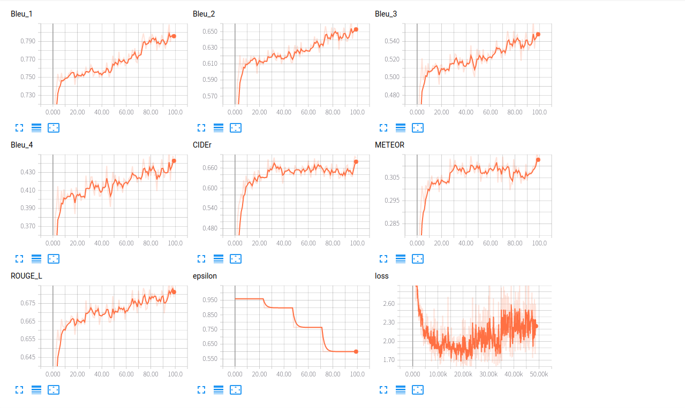
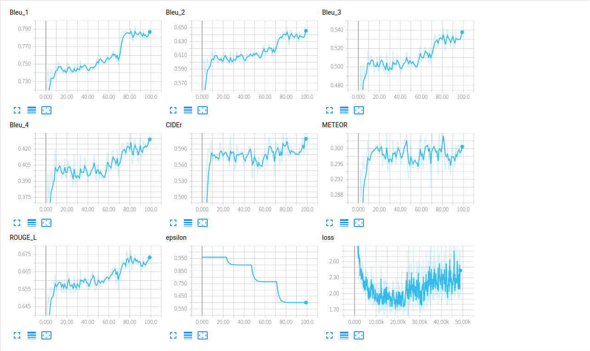
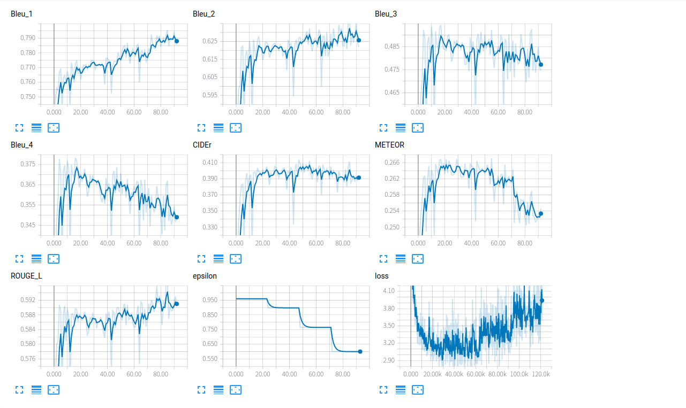

# Introduction
Partial implementation of [Hierarchical Boundary-Aware Neural Encoder for Video Captioning](https://arxiv.org/abs/1611.09312). The C3D part is implemented but not work well.

**Difference from original paper**: In the original paper, the author sampled every 5 frames, while I sampled fix number of frames using *np.linspace*.

# Requirements
## Pretrained Model
- VGG16 pretrained on ImageNet [PyTorch version]: https://download.pytorch.org/models/vgg16-397923af.pth
- ResNet50 pretrained on ImageNet [PyTorch version]: https://s3.amazonaws.com/pytorch/models/resnet50-19c8e357.pth
- C3D pretrained on Sports1M [ported from Keras]: http://imagelab.ing.unimore.it/files/c3d_pytorch/c3d.pickle

## Datasets
- MSVD: https://www.microsoft.com/en-us/download/details.aspx?id=52422
- MSR-VTT: http://ms-multimedia-challenge.com/2017/dataset
## Packages
- torch
- torchvision
- numpy
- scikit-image
- nltk
- h5py
- pandas
- future  # python2 only
- tensorboard_logger  # for use tensorboard to view training loss

You can use:

        (sudo) pip2 install -r requirements.txt
        
to install all the above packages.
# Usage
## Preparing Data
Firstly, we should make soft links to the dataset folder and pretrained models. For example:

        mkdir datasets
        ln -s YOUR_MSVD_DATASET_PATH datasets/MSVD
        mkdir models
        ln -s YOUR_RES50_MODEL_PATH models/
        
somes detail can be found in args.py.

**Note**: If you use the MSR-VTT dataset, there are some extra steps. The MSR-VTT dataset split the train_val and test video data into two zip files, so as the annotations. So please merge the two parts of video data (annotations) into one directory (json file), and modify the **msrvtt_video_root** and **msrvtt_anno_json_path** variables in args.py

Then we can:

1. Prepare video feature:

        python2 video.py
        
2. Prepare caption feature and dataset split:

        python2 caption.py
## Training
Before training the model, please make sure you can use GPU to accelerate computation in PyTorch. Some parameters, such as batch size and learning rate, can be found in args.py.
        
3. Train:

        python2 train.py
## Evaluating
        
4. Evaluate:

        python2 evaluate.py best
        
5. Sample some examples:

        python2 sample.py
        
## Trained Model
On MSVD: https://mega.nz/#!5pRQEaZC!zmCkfjtmqAIEMUgoT0_PFX9Ame-oNAO5SU0brIm_lqI

On MSR-VTT: https://mega.nz/#!Q0RHXYLa!2svrqHyjXaMx59aMho4GujNCnLECHyaoWnkmjHWbwUo
    
If you use the trained model, please make a directory named 'results', and then put the trained models into this directory.

# Training Logs
## MSVD

## MSVD with C3D

## MSR-VTT

**Note**: The raising of loss is because of [schedule sampling](https://arxiv.org/abs/1506.03099).
        
# Results
## Quantity
The following table shows the performance of this implementation (using ResNet50) on MSVD and MSR-VTT dataset.

| Dataset             |       B1 |       B2 |      B3 |       B4 |       M |       Cr |
| :------             | :------: | :------: | ------: | :------: | ------: | :------: |
| MSVD                |     79.8 |     65.5 |    55.1 |     44.8 |    31.6 |     69.4 |
| MSVD (+C3D)         |     79.1 |     65.4 |    54.4 |     43.2 |    30.2 |     61.6 |
| MSR-VTT             |     78.7 |     63.2 |    49.2 |     36.8 |    26.7 |     41.2 |
